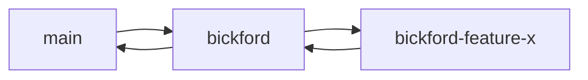
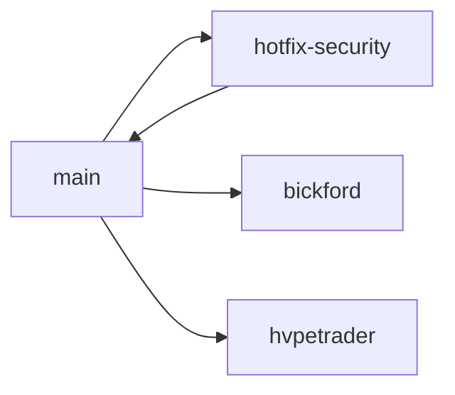
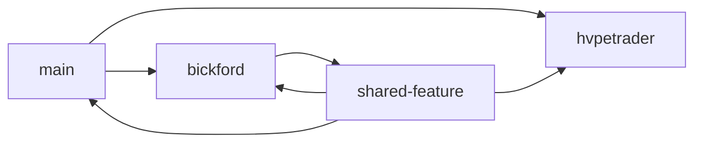

# GitHub Branch Strategy

## Quick Reference

| Branch | Status | Deploy URL | CI/CD |
|--------|--------|------------|-------|
| `main` | 🟢 Production | hvpe-cloud-portal.vercel.app | Auto-deploy |
| `bickford-mobile` | 🟡 Beta | mobile.hvpe.app | On PR |
| `bickford` | 🟢 Active | bickford.hvpe.app | On PR |
| `hvpetrader` | 🟢 Active | trader.hvpe.app | On PR |
| `bickford-for-defense` | 🟡 Beta | defense.hvpe.app | Manual |
| `penelope` | 🟢 Active | penelope.hvpe.app | On PR |
| `dad` | 🔵 Personal | N/A | Manual |
| `derek-and-jenna` | 🔵 Personal | N/A | Manual |
| `xavier` | 🔵 Personal | N/A | Manual |
| `naomi` | 🔵 Personal | N/A | Manual |

## Branch Protection Rules

### Main Branch
- ✅ Require pull request reviews before merging (1 approval minimum)
- ✅ Require status checks to pass before merging
- ✅ Require branches to be up to date before merging
- ✅ Include administrators in restrictions
- ❌ Allow force pushes: Never
- ❌ Allow deletions: Never

### Product Branches (bickford, hvpetrader, bickford-for-defense, penelope)
- ✅ Require pull request reviews for merges to main
- ✅ Require status checks to pass
- ⚠️ Allow force pushes: With lease (for rebasing)
- ❌ Allow deletions: Never

### Personal Branches (dad, derek-and-jenna, xavier, naomi)
- ⚠️ Require pull request reviews: Optional
- ⚠️ Allow force pushes: Yes (personal experimentation)
- ⚠️ Allow deletions: With care

## Workflow Patterns

### Pattern 1: Feature Development in Product Branch



1. Branch from product branch (e.g., `bickford`)
2. Develop feature in `bickford-feature-x`
3. PR back to `bickford`
4. Test in `bickford`
5. PR from `bickford` to `main` when stable

### Pattern 2: Hotfix to Main



1. Branch from `main` as `hotfix-*`
2. Fix critical issue
3. PR directly to `main`
4. Merge `main` back to product branches

### Pattern 3: Cross-Branch Feature



1. Create feature branch from `main`
2. Develop shared functionality
3. PR to relevant product branches
4. Test in each context
5. Consolidate and merge to `main`

## Pull Request Guidelines

### PR Title Format

```
[BRANCH] Category: Brief description

Examples:
[BICKFORD] feat: Add conversation memory
[TRADER] fix: Correct position sizing calculation
[DEFENSE] security: Implement CMMC compliance check
[PENELOPE] docs: Update content template guide
```

### PR Description Template

```markdown
## Branch
<!-- e.g., bickford, hvpetrader, main -->

## Type
<!-- feat, fix, docs, style, refactor, test, chore -->

## Description
<!-- What does this PR do? -->

## Changes
- [ ] Change 1
- [ ] Change 2

## Testing
<!-- How was this tested? -->

## Screenshots (if applicable)
<!-- Add screenshots for UI changes -->

## Checklist
- [ ] Code follows style guidelines
- [ ] Tests added/updated
- [ ] Documentation updated
- [ ] No breaking changes (or documented)
- [ ] Environment variables documented (if new)
```

### PR Review Requirements

**To Main:**
- Minimum 1 approval from core team
- All CI checks pass
- No merge conflicts
- Documentation updated

**To Product Branches:**
- Minimum 1 approval from branch owner or team
- CI checks pass
- Tested in branch-specific environment

**To Personal Branches:**
- No approval required
- Self-merge allowed

## Merge Strategies

### Main Branch
- **Squash and Merge**: For feature PRs (keeps history clean)
- **Merge Commit**: For version releases and major updates

### Product Branches
- **Rebase and Merge**: For small features (linear history)
- **Merge Commit**: For large features (preserve feature context)

### Personal Branches
- Any strategy (personal preference)

## Branch Synchronization

### Keeping Product Branches Updated

Run weekly (automated via GitHub Actions):

```bash
# Sync bickford with main
git checkout bickford
git fetch origin
git merge origin/main
git push origin bickford
```

### Resolving Conflicts

When conflicts occur during sync:

1. **Analyze**: Understand what changed in both branches
2. **Communicate**: Discuss with relevant team members
3. **Resolve**: Prefer main's changes for shared code, branch's changes for branch-specific code
4. **Test**: Run full test suite after resolution
5. **Document**: Add comment explaining resolution in merge commit

## CI/CD Configuration

### GitHub Actions Workflows

**`.github/workflows/ci.yml`** - Runs on all PRs
- Lint
- Test
- Build
- Security scan

**`.github/workflows/deploy-main.yml`** - Runs on push to main
- Build
- Deploy to production
- Notify team

**`.github/workflows/deploy-branch.yml`** - Runs on push to product branches
- Build
- Deploy to branch-specific environment
- Comment deployment URL on PRs

### Deployment Environments

Configure in GitHub Settings → Environments:

- **production** (main branch)
  - Requires approvals: Yes (2)
  - Deployment protection rules: Enabled
  
- **staging-bickford** (bickford branch)
  - Requires approvals: No
  - Auto-deploy: Yes

- **staging-trader** (hvpetrader branch)
  - Requires approvals: No
  - Auto-deploy: Yes

## Labels

### Branch Labels
- `branch:main` - Changes to main branch
- `branch:bickford` - Bickford-specific
- `branch:trader` - Trading platform
- `branch:defense` - Defense features
- `branch:mobile` - Mobile app
- `branch:penelope` - Content generation

### Type Labels
- `type:feat` - New feature
- `type:fix` - Bug fix
- `type:docs` - Documentation
- `type:security` - Security fix
- `type:breaking` - Breaking change

### Priority Labels
- `priority:critical` - Must fix immediately
- `priority:high` - Fix soon
- `priority:medium` - Normal priority
- `priority:low` - Nice to have

## Issue Tracking

### Creating Issues

Tag issues with relevant branch labels:

```markdown
Title: [BICKFORD] Chat context not persisting

Labels: branch:bickford, type:fix, priority:high

Description: ...
```

### Issue Assignment

- Issues tagged with `branch:*` should be assigned to branch owners
- Issues affecting multiple branches should be tagged with `branch:main`
- Critical issues get auto-assigned to core team

## Release Strategy

### Main Branch Releases

**Semantic Versioning**: `MAJOR.MINOR.PATCH`

- **MAJOR**: Breaking changes
- **MINOR**: New features (backwards compatible)
- **PATCH**: Bug fixes

Example: `v1.5.2`

### Product Branch Releases

**Branch-Specific Tags**: `BRANCH-MAJOR.MINOR.PATCH`

Example: `bickford-2.1.0`, `trader-1.3.5`

### Release Process

1. **Prepare Release Branch**
   ```bash
   git checkout -b release/v1.5.0
   ```

2. **Update Version**
   - package.json
   - CHANGELOG.md
   - Documentation

3. **Create PR to Main**
   - Title: `Release v1.5.0`
   - Full changelog in description

4. **Merge and Tag**
   ```bash
   git tag -a v1.5.0 -m "Release version 1.5.0"
   git push origin v1.5.0
   ```

5. **GitHub Release**
   - Create release from tag
   - Copy changelog
   - Attach build artifacts

## Troubleshooting

### Branch Diverged Too Far

```bash
# If your branch is way behind main
git checkout your-branch
git fetch origin
git rebase origin/main

# If conflicts are too complex
git merge origin/main
```

### Accidental Commit to Wrong Branch

```bash
# On wrong-branch with uncommitted work
git stash
git checkout correct-branch
git stash pop
git add .
git commit -m "Your message"
```

### Need to Undo Last Commit

```bash
# Undo but keep changes
git reset --soft HEAD~1

# Undo and discard changes (careful!)
git reset --hard HEAD~1
```

## Best Practices

### Commit Messages

Follow [Conventional Commits](https://www.conventionalcommits.org/):

```
type(scope): description

feat(auth): add OAuth login
fix(trading): correct order execution bug
docs(readme): update installation steps
style(ui): adjust button spacing
refactor(api): simplify route handlers
test(optr): add pipeline unit tests
chore(deps): update dependencies
```

### Branch Naming

```
feature/branch-specific-feature
fix/branch-bug-description
hotfix/critical-security-issue
refactor/component-name
docs/documentation-update
test/test-description

Examples:
feature/bickford-memory-system
fix/trader-portfolio-calc
hotfix/auth-token-validation
```

### Code Review Checklist

**For Reviewers:**
- [ ] Code follows style guidelines
- [ ] Logic is sound and efficient
- [ ] Tests cover new functionality
- [ ] No security vulnerabilities
- [ ] Documentation is updated
- [ ] No unnecessary dependencies
- [ ] Error handling is appropriate
- [ ] Performance considerations addressed

**For Authors:**
- [ ] Self-review completed
- [ ] Tests pass locally
- [ ] Documentation updated
- [ ] Breaking changes documented
- [ ] PR description is clear
- [ ] Linked relevant issues

## Resources

- [Git Branch Strategy](https://www.atlassian.com/git/tutorials/comparing-workflows/gitflow-workflow)
- [GitHub Flow](https://guides.github.com/introduction/flow/)
- [Conventional Commits](https://www.conventionalcommits.org/)
- [Semantic Versioning](https://semver.org/)

---

**Questions?** Ask in #dev-questions on Discord or open a GitHub Discussion.
