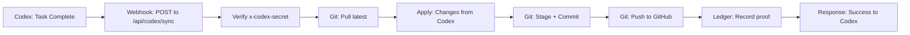

# Codex Integration Checklist

## Current Status: 🔴 NOT CONNECTED
**Codex tasks cannot auto-sync until deployment + webhook config complete**

---

## ✅ What's Already Built
- [x] `/api/codex/sync` endpoint (POST handler)
- [x] `src/lib/codex/sync.ts` (git operations)
- [x] Webhook secret generated: `d38c9f08d6b06e76efd600998fd765202efaabc109d09d2b8ad7728f4b93b12a`
- [x] Ledger integration for proof tracking
- [x] Preview mode for testing (`?preview=true`)

---

## 🔧 Setup Required (3 Steps)

### Step 1: Deploy to Vercel (5 minutes)
```bash
# Option A: GitHub Integration (Recommended)
1. Go to https://vercel.com/new
2. Import repository: bickfordd-bit/hvpe-cloud-portal
3. Add environment variables:
   - DATABASE_URL=<your_postgres_url>
   - CODEX_WEBHOOK_SECRET=d38c9f08d6b06e76efd600998fd765202efaabc109d09d2b8ad7728f4b93b12a
   - HVPE_OPENAI_API_KEY=<your_openai_key>
   - LICENSE_SESSION_SECRET=<generate_random_32_chars>
4. Click "Deploy"
5. Note your deployment URL: https://hvpe-cloud-portal-<hash>.vercel.app

# Option B: CLI (if vercel login works)
vercel login
vercel --prod
```

### Step 2: Configure Codex Webhook
In Codex settings/configuration:
```json
{
  "webhooks": {
    "onTaskComplete": {
      "url": "https://hvpe-cloud-portal-<hash>.vercel.app/api/codex/sync",
      "method": "POST",
      "headers": {
        "x-codex-secret": "d38c9f08d6b06e76efd600998fd765202efaabc109d09d2b8ad7728f4b93b12a",
        "Content-Type": "application/json"
      }
    }
  }
}
```

### Step 3: Test the Connection
```bash
# From terminal after deployment:
curl -X POST "https://hvpe-cloud-portal-<hash>.vercel.app/api/codex/sync?preview=true" \
  -H "x-codex-secret: d38c9f08d6b06e76efd600998fd765202efaabc109d09d2b8ad7728f4b93b12a" \
  -H "Content-Type: application/json" \
  -d '{
    "taskId": "test-123",
    "description": "Test connection",
    "changes": [],
    "timestamp": "'$(date -u +%Y-%m-%dT%H:%M:%SZ)'"
  }'

# Should return:
# {"success": true, "preview": true, "message": "Preview mode - no changes applied"}
```

---

## 🚨 Why Your Task Didn't Show Up

**Current Reality:**
- Codex: ✅ Task completed
- Codex → Webhook: ❌ No webhook configured
- API endpoint: ❌ Not deployed (only exists locally)
- Result: Task is stuck in Codex, can't reach repo

**After Setup:**
- Codex: ✅ Task completed
- Codex → Webhook: ✅ POST to `/api/codex/sync`
- API endpoint: ✅ Pulls changes, commits, pushes
- Result: Task appears in repo automatically

---

## 📋 Manual Workaround (Until Automation Works)

If Codex has a completed task right now:

1. **Export from Codex:**
   - Get the task output (code/changes/patch)
   - Copy to clipboard

2. **Apply Manually:**
   ```bash
   # If it's a git patch:
   codex export-patch task-123 > /tmp/codex-task.patch
   cd /workspaces/hvpe-cloud-portal
   git apply /tmp/codex-task.patch
   git add .
   git commit -m "feat: apply Codex task-123"
   git push origin mobile
   ```

3. **Record to Ledger:**
   ```bash
   # Create manual ledger entry
   cat > .bick/ledger/2025-12-19/codex-task-manual.json << 'EOF'
   {
     "id": "codex-task-manual-$(date +%s)",
     "type": "codex-manual-sync",
     "timestamp": "$(date -u +%Y-%m-%dT%H:%M:%SZ)",
     "source": "manual-application",
     "description": "Manually applied Codex task due to webhook not configured",
     "proof": {
       "commit": "$(git rev-parse HEAD)",
       "branch": "mobile"
     }
   }
   EOF
   ```

---

## 🔍 Debugging Connection Issues

### Check if endpoint is accessible:
```bash
# After Vercel deployment:
curl https://hvpe-cloud-portal-<hash>.vercel.app/api/codex/sync

# Should return: {"error": "Method GET not allowed"}
# (This is GOOD - means endpoint exists but only accepts POST)
```

### Check authentication:
```bash
# Wrong secret (should fail):
curl -X POST https://your-app.vercel.app/api/codex/sync?preview=true \
  -H "x-codex-secret: wrong-secret" \
  -d '{}'

# Should return: {"success": false, "error": "Unauthorized"}

# Correct secret (should succeed):
curl -X POST https://your-app.vercel.app/api/codex/sync?preview=true \
  -H "x-codex-secret: d38c9f08d6b06e76efd600998fd765202efaabc109d09d2b8ad7728f4b93b12a" \
  -d '{"taskId":"test","changes":[],"timestamp":"2025-12-19T00:00:00Z"}'

# Should return: {"success": true, "preview": true, ...}
```

### Check Vercel logs:
```bash
# See real-time webhook attempts:
vercel logs https://hvpe-cloud-portal-<hash>.vercel.app --follow
```

---

## 📊 Expected Workflow (After Setup)



**Timing:** ~5-10 seconds from task completion to code in repo

---

## 🎯 Priority Actions

1. **IMMEDIATE**: Share what Codex completed (I'll apply manually)
2. **HIGH**: Deploy to Vercel (enables webhook endpoint)
3. **HIGH**: Configure Codex webhook URL + secret
4. **MEDIUM**: Test with `?preview=true` curl command
5. **LOW**: Monitor first real task completion

---

## 📞 Support

If connection fails after setup:
- Check Vercel function logs for errors
- Verify CODEX_WEBHOOK_SECRET matches in both places
- Test with `?preview=true` mode first (no git operations)
- Check `.bick/ledger/` for successful webhook receipts
