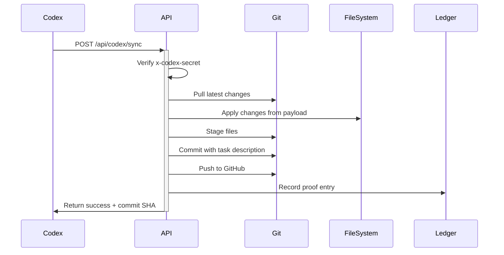

# Codex Webhook Setup Guide

## Quick Start (3 Steps)

### 1. Deploy the Webhook Endpoint

**Option A: Local Testing (Immediate)**
```bash
# Terminal 1: Start dev server
npm run dev

# Terminal 2: Test webhook
./scripts/test-codex-webhook.sh local
```

**Option B: Production Deployment (5 min)**
```bash
# Deploy to Vercel
vercel login
vercel --prod

# Note your production URL
# Example: https://hvpe-cloud-portal-abc123.vercel.app
```

### 2. Configure Codex

Add this configuration to your Codex settings:

**Webhook URL:**
```
Production: https://hvpe-cloud-portal.vercel.app/api/codex/sync
Local: http://localhost:3000/api/codex/sync
```

**Required Headers:**
```json
{
  "x-codex-secret": "d38c9f08d6b06e76efd600998fd765202efaabc109d09d2b8ad7728f4b93b12a",
  "Content-Type": "application/json"
}
```

**Payload Format:**
```json
{
  "taskId": "unique-task-id",
  "description": "What this task does",
  "timestamp": "2025-12-19T12:00:00Z",
  "changes": [
    {
      "type": "create|update|delete",
      "path": "src/file.ts",
      "content": "file contents here",
      "encoding": "utf-8"
    }
  ],
  "metadata": {
    "source": "codex",
    "agent": "your-agent-name",
    "priority": "high"
  }
}
```

### 3. Test the Connection

```bash
# Test with preview mode (no changes applied)
curl -X POST "http://localhost:3000/api/codex/sync?preview=true" \
  -H "x-codex-secret: d38c9f08d6b06e76efd600998fd765202efaabc109d09d2b8ad7728f4b93b12a" \
  -H "Content-Type: application/json" \
  -d '{
    "taskId": "test-123",
    "description": "Connection test",
    "timestamp": "2025-12-19T12:00:00Z",
    "changes": []
  }'

# Expected response:
# {"success": true, "preview": true, "message": "Preview mode - no changes applied"}
```

---

## Configuration Files

### `.codex/webhook-config.json`
Complete webhook configuration template with all environments (local/staging/production).

### `scripts/test-codex-webhook.sh`
Automated test suite for webhook integration:
```bash
# Test locally
./scripts/test-codex-webhook.sh local

# Test production
./scripts/test-codex-webhook.sh production
```

---

## Platform-Specific Setup

### If Using Make/n8n/Zapier

**Webhook Configuration:**
- **URL:** `https://hvpe-cloud-portal.vercel.app/api/codex/sync`
- **Method:** POST
- **Headers:**
  - `x-codex-secret`: `d38c9f08d6b06e76efd600998fd765202efaabc109d09d2b8ad7728f4b93b12a`
  - `Content-Type`: `application/json`
- **Body:** See payload format above

### If Using Custom Codex System

Add webhook call after task completion:

```javascript
// Node.js example
const axios = require('axios');

async function notifyTaskComplete(task) {
  await axios.post('https://hvpe-cloud-portal.vercel.app/api/codex/sync', {
    taskId: task.id,
    description: task.description,
    timestamp: new Date().toISOString(),
    changes: task.changes,
    metadata: {
      source: 'codex',
      agent: task.agent,
      priority: task.priority
    }
  }, {
    headers: {
      'x-codex-secret': 'd38c9f08d6b06e76efd600998fd765202efaabc109d09d2b8ad7728f4b93b12a',
      'Content-Type': 'application/json'
    }
  });
}
```

```python
# Python example
import requests
from datetime import datetime

def notify_task_complete(task):
    response = requests.post(
        'https://hvpe-cloud-portal.vercel.app/api/codex/sync',
        json={
            'taskId': task['id'],
            'description': task['description'],
            'timestamp': datetime.utcnow().isoformat() + 'Z',
            'changes': task['changes'],
            'metadata': {
                'source': 'codex',
                'agent': task['agent'],
                'priority': task['priority']
            }
        },
        headers={
            'x-codex-secret': 'd38c9f08d6b06e76efd600998fd765202efaabc109d09d2b8ad7728f4b93b12a',
            'Content-Type': 'application/json'
        }
    )
    return response.json()
```

### If Using GitHub Actions

Add webhook notification step:

```yaml
- name: Notify Codex Sync
  run: |
    curl -X POST "${{ secrets.WEBHOOK_URL }}/api/codex/sync" \
      -H "x-codex-secret: ${{ secrets.CODEX_WEBHOOK_SECRET }}" \
      -H "Content-Type: application/json" \
      -d '{
        "taskId": "${{ github.run_id }}",
        "description": "GitHub Action completed",
        "timestamp": "'$(date -u +%Y-%m-%dT%H:%M:%SZ)'",
        "changes": []
      }'
```

---

## Verification

### Check Webhook is Working

1. **Ledger entries appear:**
   ```bash
   ls -la .bick/ledger/$(date +%Y-%m-%d)/
   # Should show codex-sync-*.json files
   ```

2. **Git commits created:**
   ```bash
   git log --oneline --grep="codex" -5
   # Should show commits from Codex webhook
   ```

3. **Check API logs:**
   ```bash
   # Local: Check terminal running npm run dev
   # Vercel: vercel logs --follow
   ```

### Troubleshooting

**Problem: 401 Unauthorized**
- Check `x-codex-secret` header matches exactly
- No quotes/spaces in the secret value

**Problem: 405 Method Not Allowed**
- Ensure using POST method, not GET
- Check URL includes `/api/codex/sync`

**Problem: No git commits created**
- Check Vercel environment variable: `CODEX_WEBHOOK_SECRET`
- Verify changes array is not empty
- Test with `?preview=true` first

**Problem: Webhook times out**
- Large file changes may take time
- Increase timeout to 60s in webhook config
- Check git operations aren't failing

---

## Security Notes

**Secret Rotation:**
```bash
# Generate new secret
openssl rand -hex 32

# Update in 3 places:
# 1. Vercel environment: CODEX_WEBHOOK_SECRET
# 2. Codex webhook config
# 3. .codex/webhook-config.json (documentation)
```

**IP Allowlisting (Optional):**
Add to middleware.ts:
```typescript
const ALLOWED_IPS = ['1.2.3.4', '5.6.7.8'];
if (!ALLOWED_IPS.includes(request.ip)) {
  return new Response('Forbidden', { status: 403 });
}
```

---

## What Happens When Webhook Fires



**Timing:** ~3-8 seconds depending on change size

---

## Next Steps

1. ✅ Webhook endpoint ready: `/api/codex/sync`
2. ⏳ **Deploy to Vercel** (required for Codex to reach it)
3. ⏳ **Configure Codex** with production URL
4. ⏳ **Test connection** with test script
5. ⏳ **Monitor first task** completion

**Start here:**
```bash
# If not deployed yet:
vercel login
vercel --prod

# Then test:
./scripts/test-codex-webhook.sh production
```
