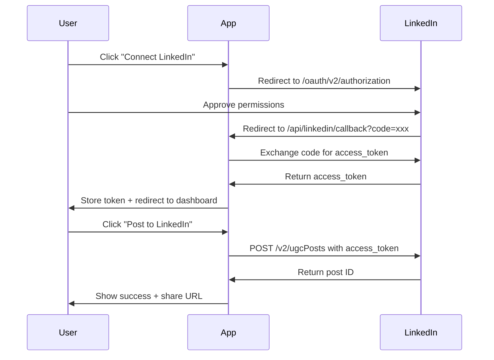

# LinkedIn Integration Setup

## Complete implementation for posting to LinkedIn

---

## 1. Get LinkedIn API Credentials

### Create LinkedIn App

1. Go to https://www.linkedin.com/developers/apps
2. Click **Create app**
3. Fill in:
   - **App name:** bickford
   - **LinkedIn Page:** (select your company page or create one)
   - **App logo:** Upload Bickford logo
4. Click **Create app**

**✅ DONE** - Your app: **bickford** (Client ID: `785qznu3cqn38v`)

### Configure OAuth Settings

1. In your app, go to **Auth** tab
2. Add **Redirect URLs:**
   ```
   http://localhost:3000/api/linkedin/callback
   https://hvpe-cloud-portal.vercel.app/api/linkedin/callback
   ```
3. Note your credentials:
   - **Client ID**
   - **Client Secret**

### Request Permissions

1. Go to **Products** tab
2. Request access to:
   - **Sign In with LinkedIn** (instant approval)
   - **Share on LinkedIn** (may require review)

---

## 2. Add Environment Variables

Add to `.env.local`:

```bash
# LinkedIn API
LINKEDIN_CLIENT_ID=785qznu3cqn38v
LINKEDIN_CLIENT_SECRET=get_from_linkedin_auth_tab
LINKEDIN_REDIRECT_URI=http://localhost:3000/api/linkedin/callback

# Production (Vercel)
# LINKEDIN_REDIRECT_URI=https://hvpe-cloud-portal.vercel.app/api/linkedin/callback
```

---

## 3. Usage

### A. Connect LinkedIn Account

```tsx
import LinkedInConnectButton from '@/components/linkedin/ConnectButton';

<LinkedInConnectButton />
```

**User clicks** → Redirected to LinkedIn OAuth → Approves → Returns authenticated

### B. Post Content

**Option 1: Using Component**

```tsx
import LinkedInPostButton from '@/components/linkedin/PostButton';

<LinkedInPostButton
  text="Just launched our new OPTR framework! Check it out:"
  linkUrl="https://hvpe.cloud/optr"
  linkTitle="OPTR Framework"
  linkDescription="Opportunity-to-Revenue optimization"
  visibility="PUBLIC"
/>
```

**Option 2: Using API Directly**

```typescript
const response = await fetch('/api/linkedin/post', {
  method: 'POST',
  headers: { 'Content-Type': 'application/json' },
  body: JSON.stringify({
    text: 'Your post content here',
    linkUrl: 'https://example.com', // optional
    linkTitle: 'Link Title', // optional
    linkDescription: 'Link description', // optional
    visibility: 'PUBLIC', // or 'CONNECTIONS'
  }),
});

const data = await response.json();
console.log('Post URL:', data.data.shareUrl);
```

**Option 3: Using Client Library**

```typescript
import { linkedInClient } from '@/lib/linkedin/client';

// Set access token (from auth flow)
linkedInClient.setAccessToken(accessToken);

// Post text only
const result = await linkedInClient.postText('Hello LinkedIn!');

// Post with link preview
const result = await linkedInClient.postWithLink(
  'Check out this article:',
  'https://example.com',
  'Article Title',
  'Article description'
);

console.log('Posted:', result.shareUrl);
```

---

## 4. API Endpoints

### `GET /api/linkedin/auth`
Initiates LinkedIn OAuth flow. Redirects to LinkedIn login.

### `GET /api/linkedin/callback`
OAuth callback handler. Stores access token and redirects back to app.

### `POST /api/linkedin/post`
Posts content to LinkedIn.

**Request Body:**
```json
{
  "text": "Your post content",
  "linkUrl": "https://example.com",
  "linkTitle": "Link Title",
  "linkDescription": "Description",
  "visibility": "PUBLIC"
}
```

**Response:**
```json
{
  "success": true,
  "data": {
    "postId": "urn:li:share:123456789",
    "shareUrl": "https://www.linkedin.com/feed/update/urn:li:share:123456789",
    "message": "Posted to LinkedIn successfully"
  }
}
```

---

## 5. Authentication Flow



---

## 6. Testing

### Local Testing

```bash
# Start dev server
npm run dev

# 1. Visit http://localhost:3000/dashboard
# 2. Click "Connect LinkedIn"
# 3. Approve permissions
# 4. Try posting content
```

### Test with cURL

```bash
# Assuming you have an access token
curl -X POST http://localhost:3000/api/linkedin/post \
  -H "Content-Type: application/json" \
  -H "Cookie: linkedin_access_token=YOUR_TOKEN_HERE" \
  -d '{
    "text": "Test post from HVPE Cloud Portal!",
    "visibility": "PUBLIC"
  }'
```

---

## 7. Rate Limits

**LinkedIn API Limits:**
- **Personal accounts:** 100 posts per day
- **Company pages:** 150 posts per day
- **API calls:** 500 per day per app

**Best Practices:**
- Cache access tokens (valid for 60 days)
- Implement retry logic with exponential backoff
- Queue posts if hitting limits

---

## 8. Production Deployment

### Vercel Environment Variables

```bash
# Add to Vercel dashboard
vercel env add LINKEDIN_CLIENT_ID
vercel env add LINKEDIN_CLIENT_SECRET
vercel env add LINKEDIN_REDIRECT_URI
```

Or use CLI:
```bash
vercel env add LINKEDIN_CLIENT_ID production
# Enter value when prompted
```

### Update Redirect URI

Change in `.env.local` and LinkedIn app settings:
```bash
LINKEDIN_REDIRECT_URI=https://hvpe-cloud-portal.vercel.app/api/linkedin/callback
```

---

## 9. Advanced Features

### Schedule Posts

```typescript
// Use with cron job or scheduled API call
import { linkedInClient } from '@/lib/linkedin/client';

async function schedulePost(text: string, scheduleTime: Date) {
  // Wait until scheduled time
  const delay = scheduleTime.getTime() - Date.now();
  await new Promise(resolve => setTimeout(resolve, delay));
  
  // Post
  return await linkedInClient.postText(text);
}
```

### Batch Posting

```typescript
const posts = [
  { text: 'Post 1', linkUrl: 'https://example.com/1' },
  { text: 'Post 2', linkUrl: 'https://example.com/2' },
];

for (const post of posts) {
  await fetch('/api/linkedin/post', {
    method: 'POST',
    body: JSON.stringify(post),
  });
  
  // Wait 5 seconds between posts
  await new Promise(resolve => setTimeout(resolve, 5000));
}
```

### Analytics Tracking

```typescript
// Track post performance
await prisma.linkedInPost.create({
  data: {
    postId: result.id,
    shareUrl: result.shareUrl,
    text: postText,
    postedAt: new Date(),
    userId: currentUser.id,
  },
});
```

---

## 10. Troubleshooting

### "Invalid redirect_uri"
- Verify URL in LinkedIn app settings matches exactly
- Check for trailing slashes
- Ensure HTTPS in production

### "Insufficient permissions"
- Request "Share on LinkedIn" product in app settings
- Wait for LinkedIn approval (can take 1-2 days)
- Use personal account for testing during review

### "Access token expired"
- Tokens expire after 60 days
- Implement token refresh flow
- Re-authenticate users when expired

### "Rate limit exceeded"
- Implement queue system for posts
- Cache aggressively
- Use exponential backoff

---

## Next Steps

1. **Get credentials** → LinkedIn Developers Portal
2. **Add to .env.local** → Client ID + Secret
3. **Test locally** → Connect account + post
4. **Deploy** → Vercel with env vars
5. **Monitor** → Check LinkedIn app analytics

**Ready to post!** Everything is implemented - just add your LinkedIn credentials.
